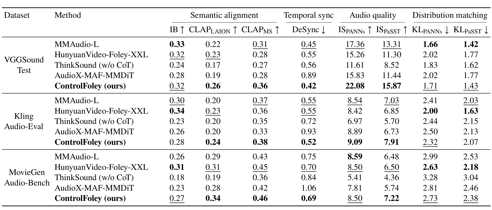
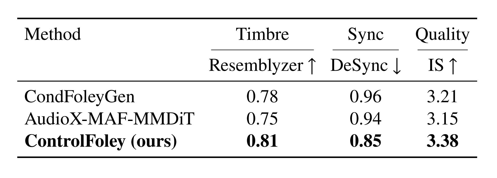

<!-- ## **ControlFoley** -->

[中文阅读](./README_zh.md)

<div align="center">

# ControlFoley: Unified and Controllable Video-to-Audio Generation with Cross-Modal Conflict Handling

<p align="center">
  <a href="https://arxiv.org/abs/2604.15086" style="text-decoration:none"></a>
  &nbsp;
  <a href="https://github.com/xiaomi-research/controlfoley" style="text-decoration:none"></a>
  &nbsp;
  <a href="https://yjx-research.github.io/ControlFoley_web_page/" style="text-decoration:none"></a>
  &nbsp;
  <a href="https://yjx-research.github.io/ControlFoley/" style="text-decoration:none"></a>
  &nbsp;
  <a href="https://huggingface.co/YJX-Xiaomi/ControlFoley" style="text-decoration:none"></a>
</p>

</div>

<p align="center">
If you find this project useful, please consider giving a star ⭐️~
</p>


<div align="center">

<hr style="border: none; border-top: 3px solid #333; margin: 16px 0;">

### 👥 **Authors**

<div>
    <!-- Row 1: 6 authors -->
    <div style="margin-bottom: 2px;">
        Jianxuan Yang<sup>1*†</sup>,&nbsp;
        Xinyue Guo<sup>1*</sup>,&nbsp;
        Zhi Cheng<sup>1,2</sup>,&nbsp;
        Kai Wang<sup>1,2</sup>,&nbsp;
        Lipan Zhang<sup>1</sup>,&nbsp;
        Jinjie Hu<sup>1</sup>
    </div>
    <!-- Row 2: 7 authors -->
    <div>
        Qiang Ji<sup>1</sup>,&nbsp;
        Yihua Cao<sup>1</sup>,&nbsp;
        Yihao Meng<sup>1,2</sup>,&nbsp;
        Zhaoyue Cui<sup>1,2</sup>,&nbsp;
        Mengmei Liu<sup>1</sup>,&nbsp;
        Meng Meng<sup>1</sup>,&nbsp;
        Jian Luan<sup>1</sup>
    </div>
</div>
<!-- Affiliations -->
<div>
    <sup>1</sup>MiLM Plus, Xiaomi Inc. &nbsp;&nbsp; <sup>2</sup>Wuhan University
    <br>
    *Equal contribution &nbsp;&nbsp; †Corresponding author
</div>
</div>

<hr style="border: none; border-top: 3px solid #333; margin: 16px 0;">

## 📰 **News**

- [2026-04] Technical report released on [arXiv](https://arxiv.org/abs/2604.15086).
- [2026-04] [Project page](https://yjx-research.github.io/ControlFoley_web_page/) is now live.
- [2026-04] [Inference code](https://github.com/xiaomi-research/controlfoley) and [pretrained models](https://huggingface.co/YJX-Xiaomi/ControlFoley) are released.
- [2026-04] Online demo is available on [Project Inference Interface](https://yjx-research.github.io/ControlFoley_web_page/#try-gen), let's try now!
- [2026-04] [Skill](https://clawhub.ai/yjx-research/controlfoley-audio-generator) ControlFoley Audio Generator released.

<hr style="border: none; border-top: 3px solid #333; margin: 16px 0;">

## 🔄 **Updates**

- [x] Release technical report on arXiv.
- [x] Launch project page.
- [x] Release inference code and pretrained models.
- [x] Launch online inference demo (available on project page).
- [x] Release skill.

<hr style="border: none; border-top: 3px solid #333; margin: 16px 0;">

## 📺 **Intro Video**

https://github.com/user-attachments/assets/d63e9837-a568-4521-9009-58b4105214a9

For more results of our model, visit [Project Page](https://yjx-research.github.io/ControlFoley_web_page/). For comparison with other methods, visit [Demo Page](https://yjx-research.github.io/ControlFoley/).

<hr style="border: none; border-top: 3px solid #333; margin: 16px 0;">

## 🎧 **Overview**

ControlFoley is a unified and controllable multimodal video-to-audio (V2A) generation framework that enables precise control over generated audio using video, text, and reference audio.

Unlike existing methods that rely on a single modality or struggle under conflicting inputs, ControlFoley is designed to handle complex multimodal interactions and maintain strong controllability even when modalities are inconsistent.

<hr style="border: none; border-top: 3px solid #333; margin: 16px 0;">

## 🎨 **Tease Figure**

<div align="center">
    
    <p style="margin-top: 8px; text-align: center; font-style: italic;">
        Left: Overview of the ControlFoley framework with three multimodal conditioning modes for controllable video-synchronized audio generation. Right: Performance radar chart of Video-to-Audio models.
    </p>
</div>

<hr style="border: none; border-top: 3px solid #333; margin: 16px 0;">

## 🚀 **Capabilities**

ControlFoley supports a wide range of applications:

- 🎬 <strong>Text-Video-to-Audio Generation (TV2A)</strong><br>
  Video-content-adaptive dubbing and synchronized sound effect generation under text guidance.

- 📝 <strong>Text-Controlled Video-to-Audio (TC-V2A)</strong><br>
  Audio generation under video–text conflicts, with semantics consistent with text prompts and temporally synchronized with video contents.

- 🎧 <strong>Audio-Controlled Video-to-Audio (AC-V2A)</strong><br>
  Audio generation conditioned on reference audio, with timbre consistent with the reference audio and temporally synchronized with video contents.

- 📝 <strong>Text-to-Audio Generation (T2A)</strong><br>
  Generate audio directly from text prompts as an additional capability of the unified framework.

<hr style="border: none; border-top: 3px solid #333; margin: 16px 0;">

## 🧠 **Key Innovations**

<div align="center">
    
</div>

- <strong>Joint Visual Encoding for Robust Multimodal Control:</strong>
  Combines CLIP and CAV-MAE-ST representations to capture both vision-language and audio-visual correlations, improving robustness under modality conflict.

- <strong>Timbre-Focused Reference Audio Control:</strong>
  Extracts global timbre representations while suppressing temporal cues, enabling precise acoustic style control without affecting synchronization.

- <strong>Modality-Robust Training with Unified Alignment:</strong>
  Introduces all-modality dropout and a unified REPA objective to improve robustness across diverse modality combinations.

- <strong>VGGSound-TVC Benchmark:</strong>
  A new benchmark for evaluating textual controllability under visual-text semantic conflicts.

<hr style="border: none; border-top: 3px solid #333; margin: 16px 0;">

## 🧪 **VGGSound-TVC Benchmark**

We propose VGGSound-TVC to evaluate text controllability under varying levels of visual-text conflict. In this dataset, textual descriptions of videos are reconstructed in accordance with the rules described below.

- L0 → No conflict, where the textual description is consistent with the video content.
- L1_subject →  A mild semantic conflict introduced at the subject level, where the action description remains unchanged while the sounding subject is replaced.
- L1_action → A mild semantic conflict introduced at the action level, where the subject remains unchanged while the action description is modified.
- L2 → A moderate semantic conflict in which the textual description belongs to a different semantic category while still maintaining a similar temporal structure or acoustic rhythm.
- L3 → Strong conflict, where the textual description is randomly substituted.

This enables systematic analysis of modality dominance and controllability under increasing inconsistency. Example samples from VGGSound-TVC are as follows.
<div align="center">
    
</div>

<hr style="border: none; border-top: 3px solid #333; margin: 16px 0;">

## 📊 **Performance**

ControlFoley achieves strong performance across multiple V2A tasks, demonstrating both high generation quality and robust controllability.

🎬 <strong>TV2A</strong>

ControlFoley achieves state-of-the-art performance across multiple benchmarks, including VGGSound-Test, Kling-Audio-Eval, and MovieGen-Audio-Bench.

- Highest CLAP scores (better semantic alignment)
- Lowest DeSync (better temporal synchronization)
- Best overall IS (better audio quality)—Up to 27% relative improvement (22.08 vs. 17.36 on VGGSound).

<div align="center">
    
</div>

📝 <strong>TC-V2A</strong>

ControlFoley demonstrates strong textual controllability under increasing visual-text conflict.

- Maintains high CLAP (text alignment) across conflict levels  
- Effectively reduces IB under conflict (less reliance on visual bias)  
- Achieves better balance between controllability and generation quality  

<div align="center">
    
</div>

🎧 <strong>AC-V2A</strong>

ControlFoley achieves the best performance across all evaluation metrics on the Greatest Hits dataset.

- Better timbre similarity (Resemblyzer)  
- Better synchronization (DeSync)  
- Higher audio quality (IS)  
  
Notably, it outperforms CondFoleyGen, a specialized in-domain baseline, demonstrating strong generalization ability.

<div align="center">
    
</div>

##
ControlFoley also demonstrates competitive or superior performance compared to strong proprietary systems such as Kling-Foley, highlighting its effectiveness as an open and controllable solution.

<hr style="border: none; border-top: 3px solid #333; margin: 16px 0;">

## 🛠 **Quick Start**

### 🔑 **Prerequisites**

- Python 3.10+
- PyTorch 2.5.1+
- CUDA 11.8+
- FFmpeg (conda install -c conda-forge ffmpeg)

### 🧱 **Installation**

```bash
# Clone the repository
git clone https://github.com/xiaomi-research/controlfoley
cd controlfoley

# Create conda environment
conda create -n controlfoley python=3.10.16
conda activate controlfoley

# Install dependencies
pip install -r requirements.txt

# Download pretrained weights
pip install huggingface-hub==0.26.2
huggingface-cli download YJX-Xiaomi/ControlFoley --resume-download --local-dir model_weights --local-dir-use-symlinks False
```

Or you can download the weights from [here](https://huggingface.co/YJX-Xiaomi/ControlFoley/tree/main/) and put them in the `model_weights` folder.

### 🎨 **Inference**

```
python demo.py [OPTIONS]

Options:
  --video            TEXT       Path to the input video file. (default: None)
  --audio            TEXT       Path to the input reference audio file. (default: None)
  --prompt           TEXT       Textual prompt for audio generation. (default: None)
  --negative_prompt  TEXT       Negative textual prompt for audio generation. (default: None)
  --duration         FLOAT      Duration of the generated audio in seconds. (default: 8.0)
  --output           TEXT       Output directory for generated audio files. (default: ./output)
```

### 📌 **Supported Tasks**

| Task   | video      | audio      | prompt   |
|--------|------------|------------|----------|
| TV2A   | required   | None       | required |
| TC-V2A | required   | None       | required |
| AC-V2A | required   | required   | optional |
| V2A    | required   | None       | None     |
| T2A    | None       | None       | required |

### 📋 **Usage Examples**

- TV2A

```bash
python demo.py --video "assets/001.mp4" --prompt "the skateboard wheels scraping and grinding on the ground." --duration 8.0 --output "./output"
```

- TC-V2A

```bash
python demo.py --video "assets/002.mp4" --prompt "man whistling." --duration 8.0 --output "./output"
```

- AC-V2A

```bash
python demo.py --video "assets/003.mp4" --audio "assets/003.wav" --duration 8.0 --output "./output"
```

- V2A

```bash
python demo.py --video "assets/004.mp4" --duration 8.0 --output "./output"
```

- T2A

```bash
python demo.py --prompt "A bird sings melodically in a forest." --duration 8.0 --output "./output"
```

<hr style="border: none; border-top: 3px solid #333; margin: 16px 0;">

## 📝 **Citation**

If you find this repository useful, please consider citing our paper:

```bibtex
@misc{yang2026controlfoleyunifiedcontrollablevideotoaudio,
  title={ControlFoley: Unified and Controllable Video-to-Audio Generation with Cross-Modal Conflict Handling}, 
  author={Jianxuan Yang and Xinyue Guo and Zhi Cheng and Kai Wang and Lipan Zhang and Jinjie Hu and Qiang Ji and Yihua Cao and Yihao Meng and Zhaoyue Cui and Mengmei Liu and Meng Meng and Jian Luan},
  year={2026},
  eprint={2604.15086},
  archivePrefix={arXiv},
  primaryClass={cs.MM},
  url={https://arxiv.org/abs/2604.15086}, 
}
```

<hr style="border: none; border-top: 3px solid #333; margin: 16px 0;">

## 🔒 **License**

This repository is licensed under the [Apache License 2.0](./LICENSE) and the [model weights](https://huggingface.co/YJX-Xiaomi/ControlFoley/tree/main/) are licensed under the [CC BY-NC 4.0](https://creativecommons.org/licenses/by-nc/4.0/).

<hr style="border: none; border-top: 3px solid #333; margin: 16px 0;">

## 🙏 **Acknowledgments**

This project uses the following datasets:<br>
VGGSound, Kling-Audio-Eval, The Greatest Hits (<a href="https://creativecommons.org/licenses/by/4.0/" target="_blank" style="color:#007bff; text-decoration:none;">CC BY 4.0</a>),
and MovieGen-Audio-Bench (<a href="https://creativecommons.org/licenses/by-nc/4.0/" target="_blank" style="color:#dc3545; text-decoration:none;">CC BY-NC 4.0</a>).<br>
All resources are used for <strong>academic and non-commercial demonstration purposes only</strong>.

This project is inspired by the following works:<br>
[stable-audio-tools](https://github.com/Stability-AI/stable-audio-tools), [MMAudio](https://github.com/hkchengrex/MMAudio), [Make-An-Audio 2](https://github.com/bytedance/Make-An-Audio-2), [Synchformer](https://github.com/v-iashin/Synchformer), and [audiocraft](https://github.com/facebookresearch/audiocraft).<br>
Thanks for their contributions.

<hr style="border: none; border-top: 3px solid #333; margin: 16px 0;">

## 📞 **Contact**

If you have any questions or suggestions, please feel free to contact us at yangjianxuan@xiaomi.com.

<hr style="border: none; border-top: 3px solid #333; margin: 16px 0;">

<div align="center">

2026 ControlFoley Project. All Rights Reserved.

</div>
